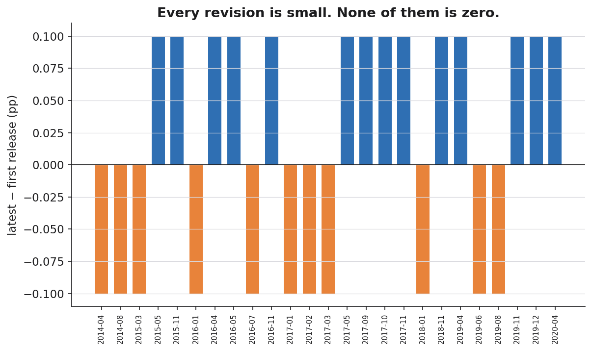
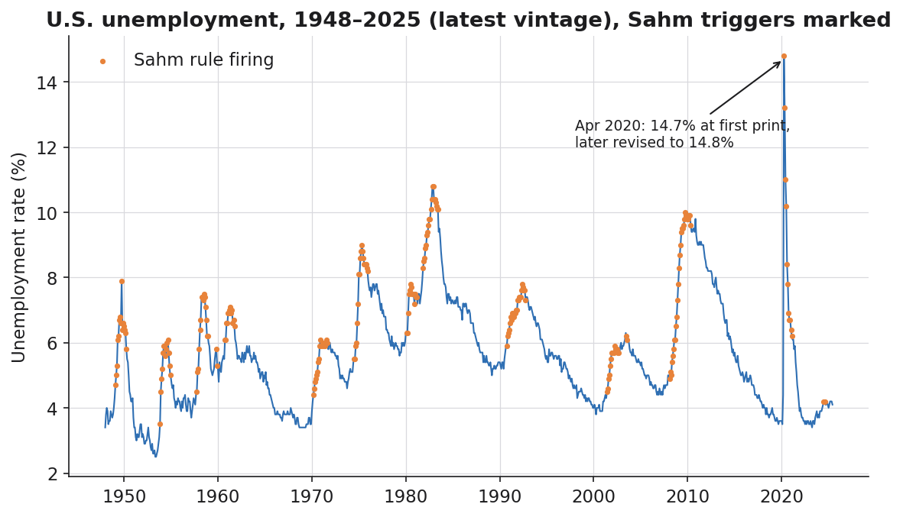

# Backtesting Without Cheating: Bitemporal Joins, As-Of Correctness, and the Sahm Rule

*Every backtest you've ever run had access to a number it couldn't have known. Here's how that look-ahead bias gets in, how to measure it, and how to build joins that physically cannot cheat.*

---

In the [first article](./the-two-clocks-bitemporal-time-series.md) I made one claim and built an engine to back it up: every operational number is an event in two times — *when it was true* (valid time) and *when you knew it* (transaction time). We stored real U.S. unemployment vintages as `(period, vintage_date, value)` triples and could reconstruct exactly what anyone believed on any past date.

That was the easy half. This is the half that costs people money.

Because once you have two clocks, a brutal question follows: **every backtest, every "what would this strategy have done" analysis, every model evaluated on historical data — which clock was it reading?** Almost always, the answer is the wrong one. And the bias only ever runs in the flattering direction.

All the code and data are in the [repo](.). It runs on real numbers.

---

## The lie of the look-ahead backtest

Here is how essentially every backtest is built, and why it lies.

You have a decision rule. You want to know how it would have performed. So you pull the historical series — *the current version of it* — line your rule up against each past date, and tally the results. Clean, fast, reproducible. And quietly, structurally wrong.

The series you pulled is **today's vintage**. Every value in it reflects every revision, correction, and re-estimation that has happened *since* the date you're pretending to make a decision on. When your rule "decides" something in March 2018, it is reading numbers that didn't exist until 2020, 2023, today. You have handed your past self a newspaper from the future and then congratulated it on its foresight.

This is look-ahead bias, and people wave it away because the revisions sound small. A tenth of a point here. A rounding correction there. But "small" is the wrong axis. The right axis is: **does the revision move the number across a threshold your rule cares about?** If it does, the size is irrelevant. A 0.1-point revision that nudges a value from *just below* a trigger to *just above* it doesn't change your data by 0.1. It changes your backtest's answer from *no* to *yes*.

The only honest backtest asks each past decision exactly what it could have seen at the time — not one revision more.

---

## The as-of join, and the leak it exposes

The fix is a join, but a particular kind of join. Not "attach the value for this period." That's the one that cheats. The correct operation is **as-of**: attach the value for this period *as it was known on the decision date*. It's the `as_of(period, knowledge_date)` query from Article 1, applied across a whole table of decisions at once.

To make the bias impossible to hand-wave, the join computes both numbers side by side — what you *could* have known, and what you'd read *today* — and reports the difference explicitly as a column called `leak`:

```python
def asof_join(decisions, series):
    """For each (decision_date, period) row, attach:
        known_value  -- series.as_of(period, decision_date)   no look-ahead
        latest_value -- the value we would read today          look-ahead
        leak         -- latest_value - known_value             the bias
    """
    out = decisions.copy()
    known, latest = [], []
    for _, row in out.iterrows():
        known.append(series.as_of(row["period"], row["decision_date"]))
        latest.append(series.latest(row["period"]))
    out["known_value"]  = known
    out["latest_value"] = latest
    out["leak"] = [None if k is None or l is None else round(l - k, 4)
                   for k, l in zip(known, latest)]
    return out
```

`leak` is the whole point. It is, literally, the quantity of future knowledge that a naive backtest would have smuggled into each decision. Run it against the real vintage panel and three rows tell the entire story:

```
decision_date     period  known_value  latest_value  leak
   2018-03-01  2017-09-01         4.2           4.3   0.1
   2020-06-01  2020-04-01        14.7          14.8   0.1
   2025-12-01  2017-09-01         4.3           4.3   0.0
```

Read those rows slowly, because each one is a different lesson.

**Row one.** A model deciding something in March 2018, looking at September 2017, would have seen **4.2%** — that was the official number then. Pull that same month today and you get **4.3%**. The leak is +0.1. Every backtest that uses today's 4.3 for a 2018 decision is reading a number that did not exist for another two years.

**Row two.** April 2020 was **14.7%** to anyone asking in June 2020 — the famous front-page figure. It's **14.8%** today. Same leak, on the most-quoted data point of the pandemic.

**Row three** is the punchline. Ask about September 2017 *from December 2025*, and `known_value` and `latest_value` agree at 4.3 — leak zero. The bias isn't a property of the period. It's a property of **the distance between when you decided and when you're reading.** The further your backtest sits from the decision it's simulating, the more future it leaks in. A naive backtest leaks the maximum possible amount, every time, by construction.

The discipline that closes the leak is a one-word rule: **always join on the knowledge clock, never on the world clock.**

Every one of those leaks is a real revision sitting in the panel — here is the full set of them, each a ±0.1pp correction that a naive backtest would read as if it had always been there:



Individually trivial. Collectively, they are the difference between a backtest that reproduces reality and one that quietly flatters it.

---

## A signal that lives on revised data: the Sahm Rule

Abstract leaks are easy to ignore, so let's run a real recession indicator that is defined directly on the series that gets revised — which makes it maximally exposed.

The **Sahm Rule** (Claudia Sahm, 2019) is elegant: a recession signal fires when the three-month moving average of the unemployment rate rises at least **0.50 percentage points** above its lowest point in the prior twelve months. It's a real-time recession alarm, and it is a perfect stress test for bitemporal correctness for one reason — *it is built on UNRATE, the exact series that carries decades of revision history.* The trigger can move when the data underneath it moves.

The implementation is just the definition, transcribed:

```python
def sahm_trigger(level):
    level = level.sort_index()
    ma3   = level.rolling(3).mean()
    low12 = ma3.rolling(12).min()
    gap   = (ma3 - low12).round(2)
    return pd.DataFrame({"ma3": ma3.round(3), "low12": low12.round(3),
                         "gap": gap, "triggered": gap >= 0.50})
```

Run it on the latest real vintage and the recent firings line up exactly with economic history:

```
              ma3  low12  gap  triggered
period
2021-02-01  6.433  3.833  2.6       True     <- COVID aftermath, screaming
2024-07-01  4.100  3.600  0.5       True     <- fires right at the 0.50 line
2024-08-01  4.167  3.667  0.5       True
```



Look at July 2024: a gap of **exactly 0.50**. The rule fires on the equality. This is precisely the kind of trigger that lives or dies on a revision. Nudge that three-month average down by a single rounding step and the gap drops to 0.49 and the signal goes *silent*. A month sitting exactly on a threshold is a month whose entire meaning is hostage to which vintage you read.

---

## Being honest about what three vintages can and can't show

Here is where I have to be straight with you instead of selling the demo, because the integrity of this whole exercise depends on it.

I compared the Sahm trigger computed on an earlier snapshot versus the latest snapshot across their overlapping window, looking for a month where the *signal itself flips* — fires in one vintage, stays quiet in the other:

```
No Sahm-trigger month flips between these two vintages on the
overlapping window -- the revisions are real but sub-threshold here.
```

No flip. And I'm showing you that result rather than burying it. The three real vintages I captured differ only by ±0.1pp in scattered months, and none of those revisions happen to land on a Sahm boundary in the overlap. The revisions are real; they just aren't, in this particular three-vintage panel, large enough or positioned to tip the indicator.

So am I claiming a problem that doesn't exist? No — and the distinction matters. The leak is **provably present** in the as-of join above: the same period genuinely reads 4.2 then and 4.3 now. What the three-vintage panel can't do is manufacture a dramatic signal-flip it didn't contain. To see borderline triggers actually flip, you need the *full* FRED vintage panel — dozens of vintages, many at single-month resolution around revision events — not three snapshots. The repo's `fetch_vintages.py` pulls exactly that with a free API key:

```python
# full revision history: every (date, realtime_start, realtime_end, value)
df = fetch_vintages_api("UNRATE", api_key="YOUR_KEY")
```

The methodology is the asset here, and it's correct at any resolution. The three-vintage demo proves the leak exists and is measurable. The full panel is where you'd go to quantify how often it changes a verdict. **Claiming more than your data shows is its own kind of look-ahead bias — pretending to know something you haven't actually measured.** I'd rather hand you a true small result and the tool to scale it than a flashy one you can't reproduce.

---

## Storing two clocks: validity intervals instead of overwrites

If you're going to query the knowledge clock, you have to store it. The pattern is the one data warehousing has used for decades under the name **slowly changing dimension type 2** (SCD2): never update a row in place; close the old one and open a new one. Each fact carries the window of transaction time during which it was the official answer.

The engine's `to_scd2()` collapses the vintage panel into exactly these validity intervals. Here's April 2020, the whole life of that number in two rows:

```
    period  value  know_from    know_to    is_current
2020-04-01   14.7 2020-05-08 2025-07-03         False
2020-04-01   14.8 2025-07-03        NaT          True
```

That reads in plain English: **14.7% was the official answer for April 2020 from May 8, 2020 until July 3, 2025; from then on it's 14.8%, and that's current.** A query that asks "what was April 2020 as of January 2022?" lands inside the first interval and gets 14.7 — automatically, because the interval says so. And here's 2014-04, a finished month rewritten years later:

```
    period  value  know_from    know_to    is_current
2014-04-01    6.3 2018-02-02 2020-05-08         False
2014-04-01    6.2 2020-05-08        NaT          True
```

April 2014 was 6.3% for years, then a seasonal-adjustment re-estimation moved it to 6.2%. Both facts are true; they're true *at different transaction times*, and the interval columns are what keep them from overwriting each other.

The non-negotiable discipline: **append-only, never overwrite.** The moment you `UPDATE` a value in place, you have destroyed the receipt for everything that read it before. Every revision is a new row with a fresh `know_from` and a closed `know_to` on its predecessor. Storage is cheap. Reconstructing a number you overwrote three years ago is not.

---

## Production patterns: where this actually lives

You don't have to hand-roll this. The pattern shows up, by different names, everywhere serious teams handle time:

- **Feature stores** call it *point-in-time correctness*. Tecton, Feast, and friends do an as-of join between your feature values and your training labels precisely so a model never trains on a feature value that postdates the label. It is the same `as_of(period, decision_date)` operation, productized — because look-ahead leakage is the single most common way to ship a model that backtests beautifully and dies in production.
- **SQL temporal tables.** `SYSTEM_TIME` in the SQL:2011 standard — `FOR SYSTEM_TIME AS OF '2020-06-01'` — is transaction-time querying built into the database. The engine keeps the history table; you write the as-of query as a clause.
- **Lakehouse time travel.** Delta, Iceberg, and Hudi let you query a table `AS OF` a version or timestamp. That's transaction time at the storage layer — though note it tracks *when the row landed in your table*, which is only the same as *when the fact became knowable* if your ingestion is honest about late and revised data. Bitemporal modeling is what closes that gap.
- **Partition by knowledge date.** The cheapest version that still works: physically partition your warehouse by vintage/as-of date so that "give me the world as known on date X" is a partition prune, not a full-table archaeology dig.

The names differ. The move is identical: keep both clocks, and join on the one that matches the question.

---

## Why I care about this more than the unemployment rate

I don't spend my days on BLS releases. I spend them around industrial and operational data — systems where decisions get made against numbers that are still settling. And the failure mode is exactly the BLS failure mode, minus the public revision history that would have warned you.

A production figure gets restated after a reconciliation. A sensor backfills when a gateway flushes a buffer and yesterday's "final" reading changes today. An aggregate gets recomputed when an upstream correction propagates. Then six months later someone runs an analysis — "would this operating rule have caught the problem?" — against *the current state of the data*, gets a clean answer, and ships a rule that was trained on knowledge it would never have had in the moment. Same leak. Same flattering direction. No ALFRED to keep the receipts.

The framing I keep coming back to: **decisions-as-code demand data-as-of.** If you're going to encode a decision rule and run it automatically, you owe it a faithful reconstruction of the world as it existed when each decision fires — not a tidied-up retrospective. A rule evaluated against revised data isn't a backtest of your rule. It's a backtest of your hindsight.

And the audit question is the one that should keep you honest: when someone asks *"why did the system do that, on that day?"*, the only acceptable answer is a query that returns what the system actually saw — not what you know now. If you can't run that query, you don't have an audit trail. You have a story.

---

## The whole argument, in five lines

1. A naive backtest joins on the world clock and reads revisions that didn't exist yet — look-ahead bias, always flattering.
2. The honest operation is an **as-of join** on the knowledge clock; the `leak` column measures exactly how much future you'd otherwise smuggle in.
3. Thresholds make small revisions decisive — a 0.1-point nudge across a 0.50 Sahm boundary flips the verdict, not the value.
4. Store it **append-only** as validity intervals (SCD2): close the old row, open a new one, never overwrite.
5. Feature stores, SQL `SYSTEM_TIME`, and lakehouse time-travel are all the same discipline wearing production clothes.

The cost is one join done correctly and the refusal to ever overwrite. The payoff is a backtest that tells you what would actually have happened — and an answer, on demand, to the only question that matters after something goes wrong: *what did we know, and when did we know it?*

---

*Part 1: [The Two Clocks — A Field Guide to Bitemporal Time Series](./the-two-clocks-bitemporal-time-series.md).*

*Code and data: the [`bitemporal-time-series`](.) repo. Real U.S. unemployment vintages, a dependency-light engine, an as-of backtester, the Sahm indicator, tests, and a live FRED fetcher.*
