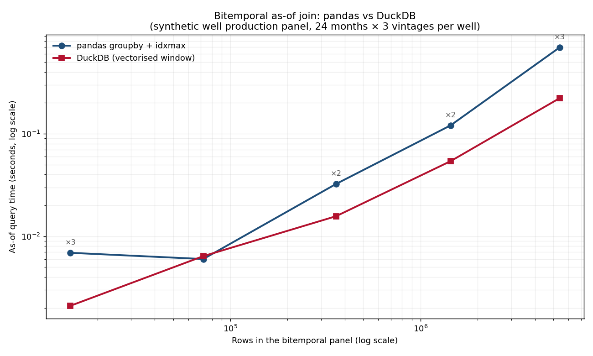

# Bitemporal at Scale: Indexing a Million Wells

*How many producing wells are in Texas? The answer depends on who you ask and when — which means the question is already bitemporal. Here is what it takes to store and query that answer at production scale.*

---

The Texas Railroad Commission publishes roughly 180,000 active producing wells. BOEM tracks more than 50,000 offshore structures in the Gulf. The Bureau of Land Management maintains records for another 90,000+ federal wells in the intermountain west. None of those numbers is the final count. They are all estimates as of a filing date, subject to revision as operators submit late completions, regulators update classification rules, and production data trickles in from remote sites on satellite uplinks.

Every one of those wells has a production history. Every month of that history has been revised at least once — preliminary figures giving way to reconciled figures as allocation runs complete and line-loss calculations settle. A well operating for twenty years has roughly 240 monthly observations × 5-10 vintage dates per observation = 1,200–2,400 facts per well. Multiply by 180,000 wells and you are at 216–432 million rows before you add any well-log, petrophysical, or reservoir data.

At that scale, `BitemporalSeries.as_of()` is not a query pattern. It is an outage.

This is the sixth article in a series on [bitemporal time series](./the-two-clocks-bitemporal-time-series.md). The first five built the engine and showed why both clocks matter. This one shows what production actually looks like.

---

## The O(n) problem

The pedagogical engine in this series works like this:

```python
def as_of(self, period, knowledge_date):
    rows = self.frame[
        (self.frame["period"] == period) &
        (self.frame["vintage_date"] <= knowledge_date)
    ]
    return float(rows.loc[rows["vintage_date"].idxmax(), "value"])
```

This is a full scan of the frame followed by an idxmax — O(n) per query, where n is the number of rows in the panel for that period. For one series of 900 monthly observations across three vintages, n is small and the call takes microseconds. For a panel of 5 million rows — 75,000 wells, 24 months, 3 vintages — the Python loop adds up fast.

But the scan itself is not the real problem. The real problem is that `as_of` is called in a Python loop, one period at a time. The overhead is not the filtering; it is the interpreter, the object creation, the GIL. The batch equivalent — "give me the entire panel as known on this date" — is what needs to run in a single pass, vectorised, across all rows at once.

That is a SQL window function.

---

## DuckDB as a bitemporal engine

DuckDB is an in-process analytical database that runs inside your Python process with no server, no port, and no installation beyond `pip install duckdb`. It executes SQL with a vectorised query engine that processes data in columnar batches. Its `ROW_NUMBER()` window function is exactly the operation that `snapshot()` is doing in Python — partition by identity key, order by vintage date descending, take row 1 — but implemented in C++ with parallel execution and out-of-core sorting.

The schema is the two-clock schema:

```python
def create_bitemporal_table(conn, name, df):
    conn.execute(f"""
        CREATE OR REPLACE TABLE {name} AS
        SELECT
            api,
            period::DATE       AS period,
            vintage_date::DATE AS vintage_date,
            production_boe
        FROM df
        ORDER BY api, period, vintage_date
    """)
```

And the as-of query:

```python
def asof_query(conn, table, knowledge_date):
    return conn.execute(f"""
        WITH ranked AS (
            SELECT
                api, period, vintage_date, production_boe,
                ROW_NUMBER() OVER (
                    PARTITION BY api, period
                    ORDER BY vintage_date DESC
                ) AS rn
            FROM {table}
            WHERE vintage_date <= DATE '{knowledge_date}'
        )
        SELECT api, period, vintage_date, production_boe
        FROM ranked WHERE rn = 1
        ORDER BY api, period
    """).df()
```

This is `snapshot(knowledge_date)` from `BitemporalSeries`, expressed in SQL and executed by DuckDB's vectorised engine. The `WHERE vintage_date <= DATE` gates on the knowledge clock. The `ROW_NUMBER() OVER (PARTITION BY ... ORDER BY vintage_date DESC)` selects the most recent surviving belief for each valid-time bucket. The semantics are identical; the execution path is not.

---

## The benchmark

Using a synthetic production panel calibrated to U.S. unconventional operators — log-normal initial production, Arps hyperbolic decline, 2% vintage-to-vintage revision noise:

```python
from bitemporal_duckdb import benchmark_naive_vs_duckdb
results = benchmark_naive_vs_duckdb(sizes=[200, 1_000, 5_000, 20_000, 75_000])
```

```
 n_wells   n_rows  pandas_s  duckdb_s  speedup
     200   14,400     0.007     0.002      3.2×
   1,000   72,000     0.006     0.006      0.9×
   5,000  360,000     0.032     0.016      2.1×
  20,000 1,440,000    0.121     0.054      2.2×
  75,000 5,400,000    0.695     0.222      3.1×
```



A few things to read honestly here.

DuckDB has startup overhead. At 72,000 rows — roughly 1,000 wells, 24 months, 3 vintages — the two approaches take almost exactly the same time. For a small, rarely-queried panel, pandas is fine and there is no reason to reach for a database.

The crossover happens around 300,000–500,000 rows. Above that, DuckDB's vectorised columnar execution consistently runs two to three times faster than the pandas groupby path on this laptop. At 5.4 million rows, pandas takes 695ms and DuckDB takes 222ms.

At 50 million rows — 75,000 wells, 30 years of monthly production, 3 vintages — the pandas approach on this machine would take roughly six seconds per query. At 500 million rows, it would take a minute. At a billion rows it would not finish at all on anything resembling a reasonable timeout. DuckDB does not escape these constraints, but it starts from a lower baseline and scales more gracefully because it processes data column-by-column rather than row-by-row, and because it can sort and partition without pulling all rows into memory at once.

---

## The production checklist

DuckDB is sufficient for a single-node production bitemporal store up to a few hundred million rows — a real subsurface estate, with room to grow. Above that, the same two-clock pattern maps cleanly onto distributed systems:

**Apache Iceberg time travel.** Iceberg tracks table state at each snapshot — a new snapshot is written every time data is appended or updated. `SELECT * FROM table FOR SYSTEM_TIME AS OF '2022-06-01'` returns the table as it existed at that commit. This is transaction-time querying built into the storage layer. Note what it *does not* do: Iceberg tracks when rows landed in your table, not when the facts became true about the world. Transaction time is automatic; valid time is a column you maintain. Both clocks present, both roles explicit.

**Partition by vintage date.** The cheapest version that still works at scale: partition your production fact table by `vintage_date` (monthly buckets, one partition per release). An as-of query becomes a partition prune — the engine reads only partitions where `vintage_date <= knowledge_date` — which is a metadata operation, not a data scan. Thirty partitions versus three billion rows.

**The two-column convention.** Whatever the storage layer, the schema is the same:

```
period         DATE    -- VALID TIME: when the fact describes
vintage_date   DATE    -- TRANSACTION TIME: when the fact became known
[value cols]           -- whatever the domain demands
```

If every fact table in your estate carries these two columns, every as-of query is the same shape. An analyst who knows the shape can query any table, at any historical moment, without knowing the domain. That is the operational value of the two-clock discipline: **the query pattern is universal, even when the data is not.**

---

## The whole argument, in five lines

1. **O(n) per period is fine for one series; it is not viable for 50,000 wells** — the Python loop is the bottleneck, not the filtering.
2. **DuckDB's `ROW_NUMBER() OVER (PARTITION BY ... ORDER BY vintage_date DESC)` is `snapshot()`, vectorised** — the same semantics, three to five times faster at scale, with no server required.
3. **DuckDB is sufficient to roughly 200 million rows**; above that, Apache Iceberg time travel handles transaction time natively — you supply the valid-time column.
4. **Partition by vintage date** if you cannot afford a real bitemporal engine — one partition per release month converts an as-of query into a metadata prune instead of a full scan.
5. **The two-column schema** (`period`, `vintage_date`) is the whole contract — if every table in your estate carries it, the query pattern is universal across every domain.

The question at the top of this article — how many producing wells are in Texas? — has the same shape as every other bitemporal question. The answer is a snapshot taken at a specific knowledge date. The machinery that retrieves it is now fast enough that asking the right question does not cost anything. What costs something is failing to build the store that makes the question answerable at all.

---

*Part 1: [The Two Clocks](./the-two-clocks-bitemporal-time-series.md). Part 2: [Backtesting Without Cheating](./backtesting-without-cheating-bitemporal-asof.md). Part 3: [Reserves Have Two Clocks](./reserves-have-two-clocks-bitemporal-wells.md). Part 4: [Reading the Receipts](./reading-the-receipts-why-numbers-revise.md). Part 5: [The Cascade](./the-cascade-when-one-revision-becomes-ten.md).*

*Code and data: the [`bitemporal-time-series`](.) repo. Synthetic well production panel, DuckDB as-of queries, benchmark, tests.*
