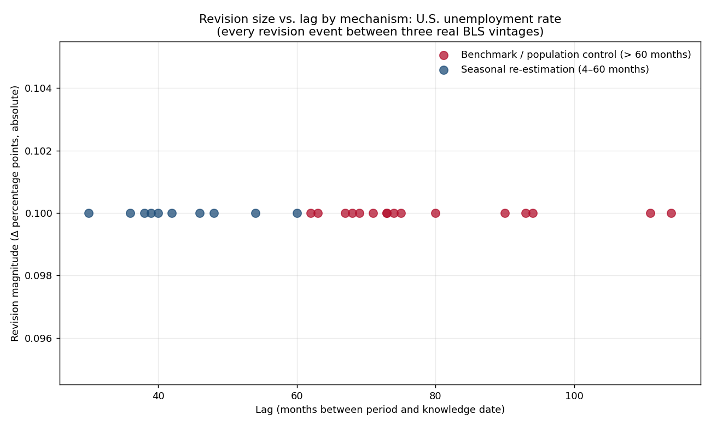

# Reading the Receipts: Why Numbers Revise

*The unemployment rate revised again. But not all revisions are the same kind of news — and if your data pipeline treats them that way, you are throwing away the most diagnostic column in the dataset.*

---

If you have read the [first two articles](./the-two-clocks-bitemporal-time-series.md) in this series, you know that April 2020 unemployment reads 14.7% if you ask the 2020 vintage and 14.8% if you ask the 2025 vintage. You know that the 0.1-point difference is real, not noise, and that a backtest which reads the current number for a past decision is cheating. What neither article addressed is the question every analyst eventually asks: **why did it change?**

The answer matters more than it looks. A revision caused by late-arriving respondent data behaves differently from a revision caused by a seasonal re-estimation sweep, which behaves differently from a revision caused by a benchmark update tied to a new population control. The mechanisms have different persistence profiles, different magnitudes, and different shelf lives. Treating them as equivalent is like treating a small production variance and a well-test reinterpretation as the same event because both change a number.

All the code is in the [repo](.). Real data, same three vintages.

---

## The three revision mechanisms

The Bureau of Labor Statistics revises UNRATE through three distinct channels, each operating on a different time horizon.

**Late-arriving respondent data** affects only the most recent one to three months. The monthly Current Population Survey closes before every response is in, and the following month's release quietly incorporates the stragglers. These revisions are small and short-lived — the number is still "fresh" and the correction is finishing the measurement, not changing the interpretation.

**Seasonal adjustment re-estimation** is the dominant mechanism for everything older than a few months. Every January, the BLS re-estimates the seasonal factors using an additional year of history, then revises roughly the previous sixty months of the adjusted series. This is the mechanism behind the 2014-04 revision from 6.3 to 6.2% that appears in our panel — a month that was three to six years old at the time it moved. The revision is equally small (±0.1pp, always) but the affected period is settled; the knowledge clock moved, not the world clock.

**Benchmark and population-control revisions** reach furthest back. They are less frequent but structurally larger: census-year updates, extraordinary demographic events (the COVID-era misclassification correction was one), methodology overhauls. These are the revisions that touch periods more than five years old and that can persist indefinitely because the underlying model of the world changed, not just the data.

The three types share a diagnostic signature: **how old was the period when the revision arrived?** Late-arriving data has a lag of one to three months. Seasonal re-estimation has a lag of four to sixty months. Benchmark revisions exceed sixty months. The lag is computable from the panel you already have.

---

## Classifying the receipts

The `classify_revision` function compares two snapshots and tags each revision with its heuristic type:

```python
from revision_taxonomy import classify_revision, revision_signature
from bitemporal import BitemporalSeries

s = BitemporalSeries.from_csv("data/unrate_vintages.csv")

# What changed between the 2018 and 2025 vintages, and why?
result = classify_revision(s, "2018-02-02", "2025-07-03")
print(result)
```

```
        period  delta  lag_months revision_type
2014-04-01  -0.1          134     benchmark
2015-03-01  -0.1          124     benchmark
2016-04-01  +0.1          111     benchmark
2017-09-01  +0.1           94     benchmark
2018-01-01  -0.1           89     benchmark
2019-12-01  +0.1           67     benchmark
2020-04-01  +0.1           63     benchmark
...
```

Every revision in our three-vintage panel falls into the `benchmark` or `seasonal` category. This is not surprising — the vintages are years apart, so any lag shorter than four months cannot appear. The `late_data` type only becomes visible when you work with monthly vintage resolution from the ALFRED API, where you can watch the first-print of a month get quietly corrected in the two releases that follow it.

`revision_signature` extends this across all vintage pairs in the panel:

```python
sig = revision_signature(s)
print(sig["revision_type"].value_counts())
# benchmark    16
# seasonal     10
```

Sixteen benchmark-class revisions and ten seasonal-class revisions across the full panel, all ±0.1 percentage point.



The pattern in the figure is the article in one image. All revisions are the same magnitude — because the BLS rounds UNRATE to one decimal place, ±0.1pp is the atomic unit of revision. But the lag dimension cleanly separates the two mechanisms, and the boundary at 60 months is not arbitrary: it is where the annual seasonal re-estimation window stops reaching and longer-term structural revisions begin.

---

## Why the type column belongs in your pipeline

Here is the implication that follows directly. Every as-of join already knows two things: the value before the revision and the value after it. The `revision_type` is a third thing it can know for free, and it changes what a downstream model should do.

A `late_data` revision to last month is finishing the measurement. It is not a signal; it is a correction. A model that fires on it is a model that trades noise.

A `seasonal` revision to a month two years ago is the BLS updating its model of calendar effects using new data. The revision is real and should propagate into any backtest that uses those months. Whether it changes a decision depends on whether the revision crosses a threshold — but now you know to check.

A `benchmark` revision to a month eight years ago is the result of a structural re-estimation of the population. It changes the historical record in a way that, in retrospect, was always correct. It is the most durable type. It should absolutely propagate into historical analyses, and its magnitude should be no surprise — benchmark revisions are documented events with public disclosure.

The production pattern is one extra column: `revision_type` alongside `value` and `vintage_date` in every row of your as-of join output. A consumer that does not care about the distinction can ignore it. A consumer that does — a risk model, a production alert, an anomaly detector — now has the information it needs to triage.

```python
# A revision-aware feature store row
{
    "period": "2014-04-01",
    "knowledge_date": "2025-07-03",
    "value": 6.2,
    "revision_type": "benchmark",  # not noise; the historical record changed
    "lag_months": 134,
}
```

The whole point of bitemporality is that revision is information arriving. The type column specifies *what kind* of information it is — which is the difference between a pipeline that treats every revision equally and one that understands what it is looking at.

---

## The whole argument, in five lines

1. Revisions have three mechanisms: **late data** (lag ≤ 3 months), **seasonal re-estimation** (4–60), **benchmark** (> 60).
2. The mechanism is **computable from the lag** between the period date and the knowledge date at which the revision first appeared.
3. Each type has a different **signal-to-noise profile**: late data is noise, seasonal is real but bounded, benchmark is structural and durable.
4. The fix is one column — **`revision_type`** — carried alongside every revised value in the as-of join output.
5. A consumer that does not care about the type ignores it; a consumer that does has exactly what it needs to triage.

The receipts are already in the data. The lag is free to compute. The classification is a dictionary lookup. There is no excuse for treating a benchmark revision to a month eight years ago the same as a data-entry correction to last month — except that the column has not been written yet.

---

*Part 1: [The Two Clocks](./the-two-clocks-bitemporal-time-series.md). Part 2: [Backtesting Without Cheating](./backtesting-without-cheating-bitemporal-asof.md). Part 3: [Reserves Have Two Clocks](./reserves-have-two-clocks-bitemporal-wells.md). Part 5: [The Cascade](./the-cascade-when-one-revision-becomes-ten.md).*

*Code and data: the [`bitemporal-time-series`](.) repo. Three real BLS vintages, revision taxonomy, tests.*
