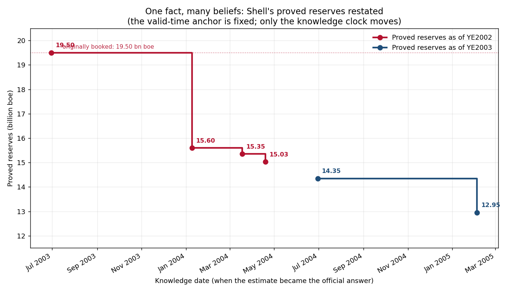

# Reserves Have Two Clocks: How Shell Lost 30% of Its Barrels Without Pumping Them

*A proved-reserves number is an estimate wearing a fact's clothing. Here's what the largest reserves restatement in modern history teaches about bitemporal data — and why decisions-as-code in the subsurface are worthless without data-as-of.*

---

Between January 2004 and February 2005, Royal Dutch/Shell deleted **5.87 billion barrels of oil equivalent** from its books — roughly **30%** of the proved reserves it had reported for year-end 2002. It did not pump them. It did not sell them. It did not lose a field to a hurricane or a nationalization. The barrels were physically exactly where they had always been. What changed was Shell's *knowledge* of whether they counted as proved — and when that knowledge changed, it took the chairman, the CFO, and the head of exploration and production down with it, drew SEC, DOJ, and FSA enforcement, and cost the company its AA+ rating.

This is the third piece in a series on **bitemporal time series** — data with two clocks: *when something is true* (valid time) and *when you knew it* (transaction time). The [first article](./the-two-clocks-bitemporal-time-series.md) built the idea on U.S. unemployment, where April 2020 is both 14.7% and 14.8% depending on which clock you read. The [second](./backtesting-without-cheating-bitemporal-asof.md) showed how ignoring the knowledge clock quietly corrupts every backtest. Now I want to take it where I actually live: the subsurface, where the single most important number on the balance sheet — proved reserves — is an estimate that revises, and where almost nobody models the second clock.

All the code and data are in the [repo](.). The Shell numbers are real, pulled from SEC filings and contemporaneous reporting.

---

## A reserves estimate is an event in two times

Here is the sentence from Article 1, transposed into a key that anyone in upstream will recognize instantly:

> A proved-reserves figure is not "the reserves of this asset." It is "the **estimated** proved reserves **for** a fixed point in time **as booked on** a particular date."

Drop the second half and you have done what Shell's reporting did for years: treated a moving estimate as a settled fact.

Watch the two clocks separate. "Proved reserves as of December 31, 2002" is a fixed valid-time anchor — that date is over, the hydrocarbons in the ground on that date are a physical reality that will never change. But the *estimate* of how many of them were proved moved, and moved, and moved again:

| Knowledge date (transaction time) | Proved reserves for YE2002 | What happened |
|---|---|---|
| 2003 (as originally booked) | **19.50 bn boe** | The number the market believed |
| 2004-01-09 | 15.60 bn boe | First restatement: −3.9 bn (−20%) |
| 2004-03-18 | 15.35 bn boe | Second restatement |
| 2004-04-19 | **15.03 bn boe** | First Half Review complete: −4.47 bn total (−23%) |

One world-clock anchor. Four different beliefs about it. The barrels never moved; the knowledge clock did. And it kept going — a *second* anchor, year-end 2003, was first stated at 14.35 bn boe in the restated 2003 report, then cut by another 1.4 bn to **12.95 bn boe** in February 2005.



If you stored only the latest value — the responsible-sounding thing — you would have the 15.03 and the 12.95 and no way to answer the question every post-mortem, every lawsuit, and every regulator actually asked: **what did we report, and when did we know it was wrong?** You'd have kept the answer and burned the receipts, on the most consequential number the company publishes.

---

## The industry already admits this — in a mandated column

Here is the part that should make every reserves engineer and every data architect sit up: **bitemporality is written into the accounting standard.**

U.S. GAAP for oil and gas (ASC 932-235-50, formerly FAS 69) requires every company to publish an annual reconciliation of proved reserves. It is a walk-forward: begin with last year's closing estimate, add extensions and discoveries, subtract production and sales — and then there is a mandatory line, by name, called **"Revisions of previous estimates."** The standard defines it precisely: revisions are changes to *prior* estimates of proved reserves, upward or downward, resulting from new information from development drilling, production history, or changed economics.

Read that definition again, because it is the thesis of this entire series, handed down by a standards board:

> **Revision is not error. Revision is information arriving.** The regulator was so sure of this that it required a column for it.

And that column is never zero. Here is a real reconciliation from a U.S. independent's 10-K, oil only, in thousands of barrels — run through the engine's `reconcile()`:

```
 year  opening  revisions  extensions  purchases  sales  production  closing
 2009  36564.0       1964         417        0.0   -402       -6207  32336.0
 2010  32336.0       3299        2668      637.0    -23       -5714  33203.0
 2011  33203.0       2988        3544    14396.0  -1950       -6427  45754.0
```

Every single year, prior estimates were revised — `[1964, 3299, 2988]` MBbls — and the closing balances tie exactly to what the company reported. The reconciliation *is* a bitemporal artifact. The "Revisions of previous estimates" line is the knowledge clock, formalized into accounting. The tragedy of the Shell case isn't that reserves revised — reserves always revise — it's that the company treated a structurally bitemporal quantity as if it had one clock, and let the gap between the two clocks grow into a 30% lie.

---

## The same engine, a different commodity

The point I most want to land for anyone building subsurface data systems: **the two clocks are domain-agnostic, so the machinery is too.** The `BitemporalSeries` engine from Article 1 — built and tested on unemployment vintages — loads Shell's reserves with zero changes. Same class, different `value_col`:

```python
from bitemporal import BitemporalSeries

reserves = BitemporalSeries.from_csv(
    "data/shell_reserves_vintages.csv",
    period_col="period",
    vintage_col="vintage_date",
    value_col="reserves_boe_bn",
)

# What was 'YE2002 proved reserves' worth, asked on different dates?
reserves.as_of("2002-12-31", "2003-09-01")   # 19.50  — what the market believed
reserves.as_of("2002-12-31", "2004-02-01")   # 15.60  — after the first restatement
reserves.as_of("2002-12-31", "2004-05-01")   # 15.03  — after the First Half Review

reserves.revision_history("2002-12-31")        # every belief, in order
reserves.total_revision("2002-12-31")          # -4.47 bn boe  (-22.9%)
```

That `as_of` query is the whole game. Ask "what were YE2002 reserves" *from September 2003* and you get 19.50 — exactly what a decision-maker, a lender, or a model would have seen at that moment, with no hindsight smuggled in. Ask the same question today and you get the restated number. A system that can only ever answer with today's number cannot reconstruct a single decision that was made before the restatement. It has no memory of having believed something else.

The unemployment series and the reserves series are the same shape of object: a fact for a period, stamped with the date it became knowable. Unemployment just happens to ship its revision history publicly through ALFRED. Reserves ship it through the ASC 932 reconciliation — and then most operators throw the history away by overwriting the estimate in their data store.

---

## It doesn't stop at reserves — it's the whole well

Reserves are the dramatic case, but the subsurface is *saturated* with two-clock data, and the pattern is identical at every timescale:

- **Production allocation.** A well's monthly volume is preliminary when first reported and gets re-allocated for months afterward as late operator reports, line-loss reconciliations, and well tests arrive. State regulators publish preliminary figures and revise them — the high-frequency analog of the seasonal-adjustment revisions in the unemployment series. "Last month's production" has a value today and a different, more complete value next quarter.
- **EUR and type curves.** Estimated ultimate recovery for a well is re-estimated every time you get more production history. The type curve you booked an AFE against is a *belief as of a date*.
- **Formation tops and petrophysics.** Tops get re-picked, logs get re-interpreted, surveys get corrected. The depth a marker "was at" can change in your database long after the bit left the hole.
- **PVT, deviation surveys, completion-as-built.** Every recalculation and correction is a new belief about a fixed physical event.

I spend my days around exactly this kind of operational and engineering data — OpenWells, RECALL, COMPASS, production histories across millions of wells. The mechanism is the BLS mechanism and the Shell mechanism: the world-clock value of a subsurface event is fixed the moment it happens, but our *knowledge* of it keeps moving as we drill more, produce more, recompute, and recategorize. Point the same `from_csv` loader at a well-level table keyed on `(api_number, vintage_date)` and every method in the engine works unchanged. **The estate is already bitemporal. Most systems just refuse to remember it.**

---

## Why this is non-negotiable for decisions-as-code

I keep coming back to one framing in my own work: **decisions-as-code demand data-as-of.** If you are going to encode subsurface decisions and run them automatically — reserve bookings, capital allocation, AFE approvals, reserve-based lending triggers, an autonomous agent that flags assets for review — then each of those decisions has to be evaluated against the world as it was actually known at the moment it fired. Against the latest vintage, you are not testing your decision rule. You are testing your hindsight, and hindsight always grades itself generously.

This is the Article 2 look-ahead problem with the stakes turned up: a reserve-replacement model "validated" on today's restated numbers would have sailed past the very exposure that ended three careers at Shell, because today's data already has the bad barrels removed. The only honest evaluation asks the as-of question.

Two payoffs follow directly, and both are things you can build once the second clock is stored:

1. **Auditability becomes a query, not an archaeology project.** When a regulator, an auditor, or a board asks *"what did we book for this asset, and when did the estimate move?"*, `revision_history(asset)` answers it in one line. Without the second clock, that question is a forensic reconstruction project — which is exactly what Shell's was.
2. **Learning velocity becomes measurable.** I've been building an "Oil Production as a Service" framing around learning velocity, and bitemporal storage gives it a precise definition at last: **learning velocity is the rate at which the knowledge clock converges on the truth.** How fast does a well's EUR estimate stabilize? How long is the gap between booking a reserve and correcting it? You cannot measure convergence if you only ever keep the converged value. Store both clocks and learning velocity stops being a slogan and becomes a number you can compute per asset, per basin, per team.

For a canonical well knowledge graph — millions of wells, each an entity that has been believed many things at many times — the bitemporal layer is what turns a static map of "current truth" into something that can answer *"show me this asset as we understood it on the date we made the decision."* That is not a reporting feature. It is the difference between a system that can defend its decisions and one that can only describe its present.

---

## The whole argument, in five lines

1. Proved reserves are a **moving estimate** attached to a **fixed valid-time anchor** — the textbook bitemporal quantity, and Shell lost 30% of its barrels by pretending otherwise.
2. The industry already admits this: ASC 932 **mandates a "Revisions of previous estimates" line**, and that line is never zero.
3. The same `BitemporalSeries` engine that handled unemployment loads reserves with **zero changes** — and the whole subsurface estate (production, EUR, tops) is bitemporal whether you model it or not.
4. **Decisions-as-code demand data-as-of:** a subsurface decision rule evaluated on the latest vintage is grading its own hindsight.
5. Store both clocks and two things you can't otherwise build fall out for free — **auditability as a one-line query** and **learning velocity as a measurable number.**

Shell's barrels never moved. Only the company's knowledge of them did — and because its systems couldn't hold "what we believed, and when," a sequence of honest re-estimations became indistinguishable from a cover-up. The discipline that prevents that is one extra column and the refusal to ever overwrite. In the subsurface, where the most valuable number you publish is an estimate that *will* revise, that discipline isn't bookkeeping hygiene. It's the difference between a data estate that can answer for itself and one that can only insist on its present.

---

*Part 1: [The Two Clocks — A Field Guide to Bitemporal Time Series](./the-two-clocks-bitemporal-time-series.md). Part 2: [Backtesting Without Cheating](./backtesting-without-cheating-bitemporal-asof.md).*

*Code and data: the [`bitemporal-time-series`](.) repo. Real Shell reserve restatement vintages, the ASC 932 reconciliation walk, and the same dependency-light engine that ran the unemployment series.*
