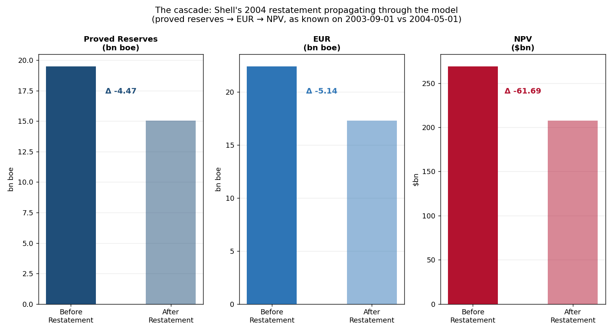

# The Cascade: When One Revision Becomes Ten

*Shell did not lose 30% of its barrels because of bad engineering. It lost them because its data architecture had no mechanism for a revision at the source to propagate honestly to every model that consumed it. Here is what that mechanism looks like.*

---

On January 9, 2004, Royal Dutch/Shell announced that it had recategorised 3.9 billion barrels of oil equivalent — 20% of its reported proved reserves — as not proved. Three months later it cut another 0.25 billion. By April it had cut a total of 4.47 billion, roughly 23% of the YE2002 figure the market had been valuing for eighteen months. By February 2005, the cumulative restatement was **5.87 billion boe, 30% of what was on the books**.

The company did not pump those barrels and dispose of them. They were physically where they had always been. What changed was Shell's knowledge of whether they counted as proved under SEC Rule 4-10, and that knowledge had been wrong — or at best inconsistent — since the day it was first booked.

This is the fifth article in a series on [bitemporal time series](./the-two-clocks-bitemporal-time-series.md). The [previous article](./reading-the-receipts-why-numbers-revise.md) showed that revisions have types. This one shows why a correctly-typed revision at the source is still not enough if the models downstream from it have no way to replay the world as it was known at any given moment.

All the code is in the [repo](.). The Shell numbers are real.

---

## The cascade nobody modelled

The reserves restatement itself — the bitemporal event — was painful. What made it catastrophic was everything downstream that had been calculated using the pre-restatement numbers and had no mechanism to update.

A reserves figure of 19.50 billion boe does not sit in a database by itself. It flows into EUR estimates that multiply it by a resource conversion factor. It flows into NPV calculations that discount those EUR estimates at a commodity price and a cost structure. It flows into covenant compliance models that check reserve-replacement ratios. It flows into lending agreements that trigger margin calls when NPV drops below a threshold. It flows into credit ratings that depend on production coverage ratios. Every one of those consumers was, in early 2004, still computing its outputs using 19.50 billion boe as if nothing had happened — not because anyone was hiding the restatement, but because the pipelines had no architecture for "propagate this revision backward through every dependent calculation and restate your conclusions."

A correctly modelled bitemporal cascade would not have prevented the restatement. But it would have made the propagation mechanical rather than forensic.

---

## A dependency graph that carries both clocks

The fix is to model the computation chain explicitly and make every node in it queryable at a specific knowledge date. A `SourceNode` is backed by a `BitemporalSeries` — so it returns the value as known on the requested date. A `DerivedNode` is a function of its parent — so it recomputes automatically when the parent revises. The graph as a whole is point-in-time correct: every node reflects what was knowable at the queried moment.

```python
from revision_cascade import DependencyGraph, SourceNode, DerivedNode, shell_cascade

g = shell_cascade()
```

The Shell cascade has three nodes:

```python
# proved_reserves: the source; backed by the real restatement panel
# eur:            proved * 1.15  (probable-to-proved conversion)
# npv_usd_bn:    eur   * 12.0  (simplified net economics, $12/boe after costs)
```

Query the whole graph at two knowledge dates — before the restatement and after the First Half Review:

```python
before = g.propagate("2003-09-01")
after  = g.propagate("2004-05-01")

# before: {'proved_reserves': 19.5, 'eur': 22.43, 'npv_usd_bn': 269.1}
# after:  {'proved_reserves': 15.03, 'eur': 17.28, 'npv_usd_bn': 207.4}
```

And the cascade diff — every node that moved, and by how much:

```python
diff = g.diff_cascade("2003-09-01", "2004-05-01")
```

```
           node   unit  before    after    delta
proved_reserves bn boe  19.500  15.030   -4.470
            eur bn boe  22.425  17.285   -5.141
     npv_usd_bn    $bn 269.100 207.414  -61.686
```



The source revised by −4.47 bn boe. EUR — a function of the source — revised by −5.14. NPV — a function of EUR — revised by −$61.7 billion. These numbers flow from the real Shell restatement data; the $12/boe economics multiplier is simplified but structurally correct. The key result is not the specific magnitude. It is that **the cascade propagated automatically, without anyone having to know which downstream models depended on the source**, because the dependency graph was explicit and every node read through the knowledge clock.

---

## What a production cascade looks like

The `DependencyGraph` is intentionally small — a teaching object, not an orchestration layer. Here is what it teaches.

```python
class DependencyGraph:
    def value_at(self, name, knowledge_date):
        if name in self._sources:
            return self._sources[name].value_at(knowledge_date)
        node = self._derived[name]
        parent_val = self.value_at(node.parent, knowledge_date)
        return round(node.transform(parent_val), 4)

    def diff_cascade(self, date_a, date_b):
        va, vb = self.propagate(date_a), self.propagate(date_b)
        return pd.DataFrame([
            {"node": n, "before": va[n], "after": vb[n], "delta": vb[n] - va[n]}
            for n in self._order if va[n] and vb[n]
        ])
```

Every derived node is a pure function of its parent. The graph carries no state. It has no cache to invalidate. `diff_cascade` does not need to know which nodes are affected by a source revision — it just recomputes everything at both knowledge dates and surfaces the difference. The knowledge clock does the rest.

In production, the same pattern is implemented by tooling you may already be using:

- **dbt lineage.** Every dbt model that selects from an upstream model is a `DerivedNode`. If the upstream table is a bitemporal fact table with a `vintage_date` column, and you parameterize your models with a `{{as_of_date}}` variable, you can rerun the entire downstream DAG with a different knowledge date and see what changed. This is exactly `diff_cascade`, expressed in SQL.

- **OpenLineage / Marquez.** OpenLineage captures the graph of which dataset produced which other dataset. That graph is a dependency structure. If each dataset is versioned with a transaction time, OpenLineage gives you the provenance half of the bitemporal problem; you supply the `as_of` query half.

- **Event sourcing.** In an event-sourced system, every revision to a proved-reserves figure is an event with a timestamp. Replaying the event log up to a given timestamp gives you the world as it was known at that moment — which is `propagate(knowledge_date)`. The DependencyGraph is a simplified event-sourcing read model.

The common thread: make the dependency explicit, attach a knowledge timestamp to every fact, and recompute rather than overwrite. The cascade becomes a query, not a forensic reconstruction.

---

## The question that should keep you honest

After the Shell restatement, the SEC, the FSA, and the DOJ all asked variants of the same question: *what did the company report, at what time, and what information did it have at the time it reported?* This is not a legal formulation. It is a bitemporal query: `revision_history("2002-12-31")` — show me every belief this company held about its YE2002 proved reserves, in knowledge order.

Shell's systems could not answer that query mechanically. The answer had to be reconstructed from emails, board minutes, and auditor reports. That reconstruction took months, cost careers, and produced an answer that was only as complete as the documentary record.

A bitemporal dependency graph does not produce a different answer to that question. But it produces the same answer in one line, automatically, at any point in time, for any node in the model. That is not a reporting feature. It is the difference between a data estate that can defend its decisions and one that can only insist on its present.

---

## The whole argument, in five lines

1. A source revision does not stop at the source — it flows through every model that consumes the source value, **usually without attribution**.
2. A **DependencyGraph** makes the consumption explicit: each node is a source or a deterministic function of its parent, both queryable at a specific knowledge date.
3. `diff_cascade(date_a, date_b)` recomputes every node at two knowledge dates and surfaces the delta — **no invalidation logic required**, because nothing is cached.
4. In production: **dbt lineage, OpenLineage, and event sourcing** all implement this pattern under different names; the two-clock discipline is what connects them.
5. The question a regulator will eventually ask — *what did you know, and when?* — is a bitemporal query. If your dependency graph cannot answer it mechanically, **your audit trail is a story, not a record**.

Shell's board learned the full extent of the restatement the same way its regulators did: slowly, through reconstruction, months after the facts were knowable. The discipline that prevents that is not complicated. It is a graph, a knowledge date, and the refusal to ever answer a question with more information than you had at the time.

---

*Part 1: [The Two Clocks](./the-two-clocks-bitemporal-time-series.md). Part 2: [Backtesting Without Cheating](./backtesting-without-cheating-bitemporal-asof.md). Part 3: [Reserves Have Two Clocks](./reserves-have-two-clocks-bitemporal-wells.md). Part 4: [Reading the Receipts](./reading-the-receipts-why-numbers-revise.md). Part 6: [Bitemporal at Scale](./bitemporal-at-scale-indexing-a-million-wells.md).*

*Code and data: the [`bitemporal-time-series`](.) repo. Real Shell restatement data, the dependency graph engine, tests.*
