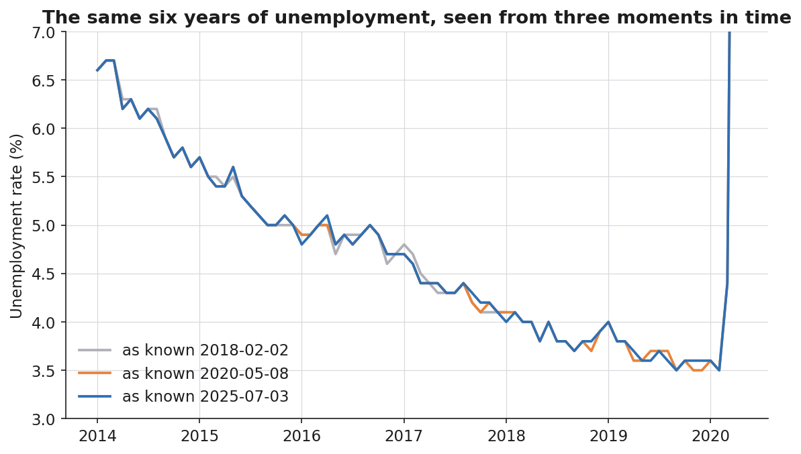

# The Two Clocks: A Field Guide to Bitemporal Time Series

*Why the most-quoted number of the pandemic is already wrong, what that teaches us about data with two clocks, and how to build a time series that never lies about what it knew.*

---

The most cited economic number of the pandemic was **14.7%**. On May 8, 2020, the Bureau of Labor Statistics reported that U.S. unemployment had hit 14.7% in April — the highest rate, and the largest one-month jump, in the entire history of the series back to 1948. It led every newscast. It anchored every model. It is printed in a thousand decks.

It is also no longer the number.

Pull the same series from FRED today and April 2020 reads **14.8%**. Nobody lied. Nobody fat-fingered a cell. The number changed because economic data — like almost all operational data — has two clocks running at once, and most of us only ever look at one of them.

This is the first of two articles on **bitemporal time series**: data that tracks not just *when something was true* but *when we knew it*. In this one I'll build the mental model and a working engine from real U.S. unemployment vintages. In the [second](./backtesting-without-cheating-bitemporal-asof.md) I'll show why getting this wrong quietly corrupts every backtest you've ever run, and how to do as-of joins that don't cheat.

All the code and data are in the repo. It runs on real numbers, not toy data.

---

## A number is an event in two times

Here is the sentence that should be tattooed on the inside of every data engineer's eyelids:

> An observation is not "the unemployment rate in April 2020." It is "the unemployment rate **for** April 2020 **as known on** a particular date."

Drop the second half and you've thrown away half the information — usually the half that bites you later.

The two clocks have names:

- **Valid time** — the period the fact describes. *April 2020.* The world-clock.
- **Transaction time** — the date the fact became knowable to you. *May 8, 2020.* The knowledge-clock.

A *uni*temporal series gives you one value per valid-time period and silently overwrites it whenever a better estimate shows up. A **bitemporal** series keeps every (valid time, transaction time) pair, so you can always reconstruct exactly what you believed on any past date.

The St. Louis Fed has been quietly making this point for decades through ALFRED — *Archival* FRED. Their own canonical example: on February 2, 1990, the BLS reported January 1990 unemployment as 5.3%. More than six years later, on March 8, 1996, that same month — January 1990, a month that was long over and would never change in the real world — was revised to 5.4%. The world-clock value of "January 1990" is fixed forever. The knowledge-clock value moved. Twice the dimension, twice the truth.

Why does a finished month get rewritten years later? For unemployment, the dominant mechanism is **seasonal adjustment**. The headline rate is seasonally adjusted, and every January the BLS re-estimates the seasonal factors using another year of data, then revises roughly the previous five years of the adjusted series. Add the COVID-era misclassification corrections, occasional methodology changes, and population-control updates, and a single month can carry a whole little history of beliefs.

None of those beliefs were wrong when they were published. They were the best available estimate *at that transaction time*. That's the entire point. **Revision is not error. Revision is information arriving.**

---

## Three real vintages, one stubborn fact

To make this concrete I assembled three genuine vintages of the unemployment series (`UNRATE`, seasonally adjusted, monthly) captured at different times:

| Vintage (transaction time) | Series covers | What April 2020 reads |
|---|---|---|
| 2018-02-02 | 1948-01 → 2018-01 | *(not yet observed)* |
| 2020-05-08 | 1948-01 → 2020-04 | **14.7** |
| 2025-07-03 | 1948-01 → 2025-06 | **14.8** |

Notice what the transaction-time clock does to the *shape* of the data, not just the values. The 2018 vintage simply has no opinion about April 2020 — that month hadn't happened. You cannot know what you have not measured, and a correct bitemporal store has to be comfortable answering a query with an honest *"unknown."* That honesty is a feature. It's exactly what keeps you from accidentally feeding future knowledge into a past decision.

When you line the three vintages up over their overlapping years, they mostly agree — and then, in scattered months, they don't:



The gray line is what we knew in early 2018. It peels away from the others by a tenth of a point here and there — late 2014, mid-2017, across 2018–2019 — every divergence a seasonal-adjustment revision caught in the act. Across the overlap, **26 distinct months** carry a different value depending on which vintage you ask. Every one of those revisions is exactly ±0.1 percentage point. Each is individually trivial. Collectively they are the difference between a series that reproduces and one that doesn't.

```
period   first_release  latest  total_revision
2014-04       6.3         6.2        -0.1
2015-03       5.5         5.4        -0.1
2016-04       5.0         5.1        +0.1
2017-09       4.2         4.3        +0.1
2018-01       4.1         4.0        -0.1
2019-12       3.5         3.6        +0.1
2020-04      14.7        14.8        +0.1
...           (26 revised months in total)
```

Here's the trap. If you're a careful analyst who *only* keeps the latest vintage — the responsible-sounding thing to do — you have quietly destroyed your ability to answer the single most important question in any retrospective: **"what did we actually know at the time?"** You've kept the answer and burned the receipts.

---

## Building a series that remembers

The fix is almost embarrassingly simple. Stop storing one value per period. Store a tidy table of facts, each stamped with both clocks:

```
period,      vintage_date,  unrate
2020-04-01,  2020-05-08,    14.7
2020-04-01,  2025-07-03,    14.8
2017-09-01,  2018-02-02,    4.2
2017-09-01,  2025-07-03,    4.3
1990-01-01,  1990-02-02,    5.3
1990-01-01,  1996-03-08,    5.4
```

That's the whole data model. Two keys, one value. Every interesting bitemporal operation is a query over this table. Here is the engine, trimmed to its spine (full version in `src/bitemporal.py`):

```python
from dataclasses import dataclass
import pandas as pd

@dataclass
class BitemporalSeries:
    frame: pd.DataFrame  # columns: period, vintage_date, value

    def as_of(self, period, knowledge_date):
        """The value for `period` as it was known on `knowledge_date`.
        Returns None if it hadn't been published yet — the honest answer."""
        period = pd.to_datetime(period)
        knowledge_date = pd.to_datetime(knowledge_date)
        rows = self.frame[(self.frame.period == period) &
                          (self.frame.vintage_date <= knowledge_date)]
        if rows.empty:
            return None
        return float(rows.loc[rows.vintage_date.idxmax(), "value"])

    def snapshot(self, knowledge_date):
        """The ENTIRE series exactly as it stood on `knowledge_date`."""
        knowledge_date = pd.to_datetime(knowledge_date)
        visible = self.frame[self.frame.vintage_date <= knowledge_date]
        idx = visible.groupby("period").vintage_date.idxmax()
        return visible.loc[idx].set_index("period").value.sort_index()
```

The two methods are the whole philosophy:

`as_of` answers *"what did we believe about this one month, on this date?"* It filters to the vintages that existed on or before the knowledge date, then takes the most recent surviving one. The `<=` is the entire game. Get the inequality right and you cannot leak the future.

`snapshot` answers the bigger question: *"reconstruct the complete series as it physically existed on this date."* It's `as_of` applied to every period at once — the dataset, frozen and time-traveled.

Run it against the real panel:

```python
s = BitemporalSeries.from_csv("data/unrate_vintages.csv")

s.as_of("2020-04-01", "2020-06-01")   # 14.7  — what June-2020-you saw
s.as_of("2020-04-01", "2025-12-01")   # 14.8  — what today-you sees
s.as_of("2020-04-01", "2019-01-01")   # None  — April 2020 hadn't happened
```

```python
# The full series, frozen at two different moments:
s.snapshot("2018-02-02").loc["2014-04-01"]   # 6.3
s.snapshot("2025-07-03").loc["2014-04-01"]   # 6.2
```

Same month. Same query. Two answers, both correct, because they were asked of two different knowledge-states. A uni­temporal series can't even express the question.

---

## The revision history of a single observation

Because every belief is retained, you can ask a question that's normally impossible: *show me the entire life story of one number.*

```python
def revision_history(self, period):
    """Every distinct value ever carried for `period`, in knowledge order.
    Consecutive vintages reporting the same number are collapsed."""
    rows = self.frame[self.frame.period == pd.to_datetime(period)] \
               .sort_values("vintage_date")
    changed = rows[rows.value.ne(rows.value.shift())]
    return changed[["vintage_date", "value"]].reset_index(drop=True)
```

```python
s.revision_history("2014-04-01")
#   vintage_date  value
#     2018-02-02    6.3      <- believed for years
#     2020-05-08    6.2      <- re-seasonalized, and it stuck
```

We collapse runs where the value didn't move, so the output is the *revision events*, not the raw vintages. That distinction matters more than it looks: a vintage where nothing changed is not news, and a good bitemporal layer should make news cheap to find and non-events free to ignore.

This is also where the second clock earns its keep operationally. When a stakeholder storms in asking *"why is this chart different from the one you showed me in March?"* — a question that has ended careers in finance and embarrassed teams in every industry I've worked in — you don't argue. You run `snapshot("2025-03-01")`, regenerate the exact chart they remember, lay it next to today's, and point at the three months that revised. The conversation goes from *"someone changed the numbers"* to *"here is the data arriving."* That is the difference between a data team that gets trusted and one that gets audited.

---

## This is not an economics problem

It is tempting to file all of this under "macro data is messy." Don't. The two-clock structure is everywhere the moment you look for it.

Sensor data backfills when a gateway reconnects and flushes a buffer — yesterday's "final" reading lands today. Financial figures restate. Inventory counts get corrected after a recount. CRM opportunity stages get retro-edited by a rep cleaning up their pipeline. Any system with late-arriving data, corrections, or recomputed aggregates is generating bitemporal facts whether or not you model them as such. I spend my days around industrial and operational data, and the pattern is identical to the BLS: the world-clock value of an event is fixed, but our *knowledge* of it keeps moving as corrections, recalibrations, and re-derivations arrive. Teams that store only "the current truth" are quietly overwriting their own audit trail every single day.

The unemployment series is just an unusually honest, unusually well-documented instance — a public dataset that ships its own revision history if you know to ask for it.

---

## Get the real data yourself

The cleanest way to pull a FRED series is `pandas_datareader` — one line, no API key:

```python
import pandas_datareader.data as web

unrate = web.DataReader("UNRATE", "fred", "1948-01-01")   # the current series
```

That's the right tool for "give me the series as it stands today." But notice what it *can't* do: under the hood it requests `fredgraph.csv?id=UNRATE` and passes no vintage parameter, so it only ever returns the **latest** revision. It hands you one clock. For the bitemporal history — every value as it was once known — you need ALFRED's realtime parameters.

To pull the *full* revision history — dozens of vintages back to 1960 — you need a free FRED API key and one request. FRED returns each observation as a `(date, realtime_start, realtime_end, value)` tuple, which *is* a bitemporal panel: the value was the official answer for `date` during the knowledge window `[realtime_start, realtime_end]`.

```python
import requests, pandas as pd

def fetch_vintages_api(series_id, api_key):
    r = requests.get("https://api.stlouisfed.org/fred/series/observations",
        params={"series_id": series_id, "api_key": api_key, "file_type": "json",
                "realtime_start": "1900-01-01", "realtime_end": "9999-12-31"})
    obs = pd.DataFrame(r.json()["observations"])
    obs = obs[obs.value != "."]                 # FRED's missing sentinel
    return pd.DataFrame({
        "period":       pd.to_datetime(obs.date),
        "vintage_date": pd.to_datetime(obs.realtime_start),  # when it became known
        "value":        pd.to_numeric(obs.value),
    })

df = fetch_vintages_api("UNRATE", api_key="YOUR_KEY")
```

Drop that frame into `BitemporalSeries` and every method above works unchanged, at full resolution. The repo wraps all three routes in `src/fetch_vintages.py`: `fetch_current` (the `pandas_datareader` one-liner, latest vintage), `fetch_vintages_api` (keyed, full history), and a keyless path that adds the `vintage_date` parameter `pandas_datareader` leaves out, one snapshot at a time.

---

## The discipline is cheap; the bug it prevents is not

Here's the whole argument in four lines:

1. Every operational number is an event in **two** times — when it was true, and when you knew it.
2. Storing only the latest value throws away the second clock and your audit trail with it.
3. The fix is a tidy table keyed on *(valid time, transaction time)* and two queries, `as_of` and `snapshot`.
4. Once you have it, "what did we know then?" becomes a one-line lookup instead of an archaeology project.

The cost is one extra column and the discipline to never overwrite. The payoff is reproducibility, auditability, and — as the next article shows — backtests that tell you the truth instead of flattering you.

The 14.7% on the front page in May 2020 was never a mistake. It was the best estimate that the knowledge-clock allowed on that date. The mistake is building systems that can't remember that the clock was ever set differently.

---

*Part 2: [Backtesting Without Cheating — Bitemporal Joins, As-Of Correctness, and the Sahm Rule](./backtesting-without-cheating-bitemporal-asof.md).*

*Code and data: the [`bitemporal-time-series`](.) repo. Real U.S. unemployment vintages, a dependency-light engine, tests, and a live FRED fetcher.*
